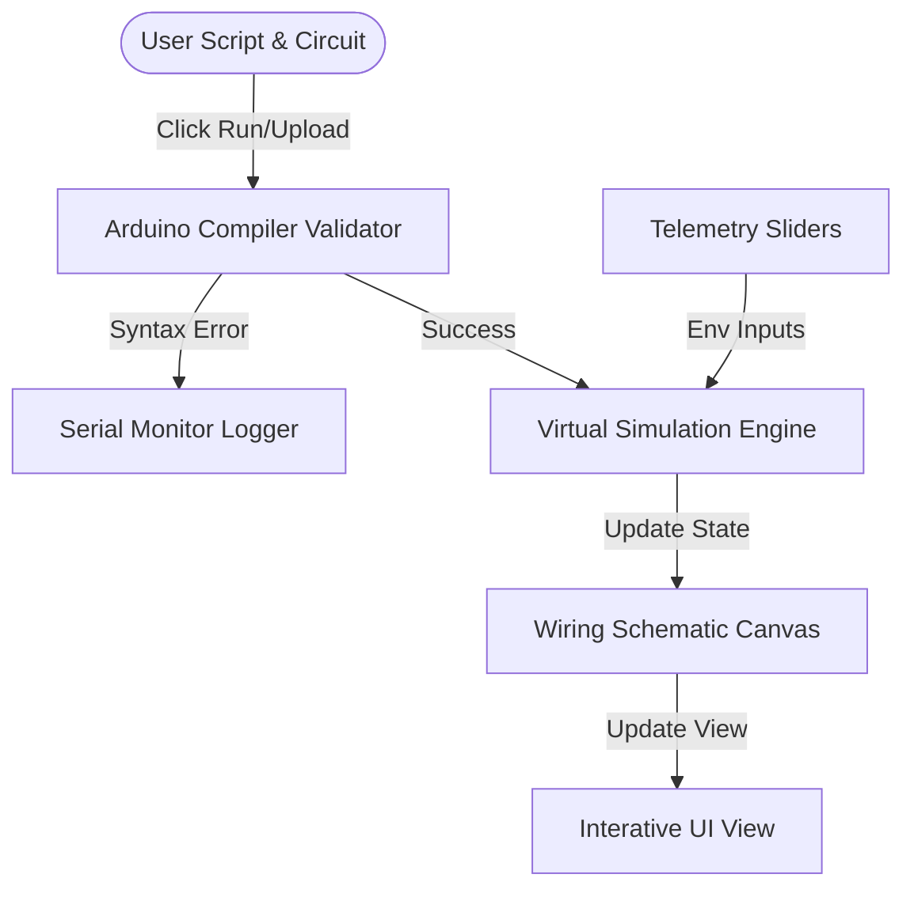

# Tech Stack & Architecture: Roboflix Virtual Lab Sandbox

Roboflix is a next-generation LMS and Virtual Hardware Prototyping Sandbox. It allows students to write Arduino C++ code, design circuit schematics using an interactive breadboard canvas, simulate telemetry environments, and receive real-time automated grading.

---

## 🛠️ Technology Stack

| Layer | Technology | Details |
| :--- | :--- | :--- |
| **Framework** | **Next.js 16.0.10** | React 19.2.0, Server-Side Rendering (SSR), App Router architecture. |
| **Language** | **TypeScript / JavaScript** | Strict typing across components, canvas math, and state. |
| **Styling & Theme** | **Tailwind CSS v4.1.9** | Utility-first styling, custom dark mode, transition utilities, and PostCSS. |
| **Database & Auth** | **Supabase** | Backend state, user progress tracking, and database bindings. |
| **Animation Engine** | **Framer Motion & Motion v12** | Cinematic hover micro-animations, slide drawers, and modal transitions. |
| **Code Editor** | **Monaco Editor** | Cloud-loaded via CDNJS with custom syntax theme (`roboflix-dark`). |
| **Offline Fallback** | **Custom Textarea Editor** | Lightweight fallback editor with custom tab indents and line numbers when Monaco is slow or offline. |
| **UI Primitives** | **Radix UI** | Accessible, unstyled primitives (Dialog, Select, Tabs, Progress, Slider, etc.). |
| **Iconography** | **Lucide React** | Premium vector icon system. |

---

## 📦 Core Architecture & Data Flow



### 1. Arduino C++ Code Compiler & Validator
Located inside [app/lms/lab/[experimentId]/page.tsx](file:///Users/ayushrana/Downloads/roboflix-landing-page%20(1)/app/lms/lab/%5BexperimentId%5D/page.tsx), `validateArduinoCode(code)` performs lightweight compiler checking before flashing or simulating:
* **Pre-Execution Abort**: Halts progress animations early if errors are found, avoiding infinite loading states.
* **Syntax Checks**: Validates existence of `void setup()` and `void loop()`, checks curly braces `{}` and parentheses `()` balancing, and scans for missing semicolons `;`.
* **API Auditing**: Restricts parameters on Arduino calls (e.g. checks that `pinMode` uses `OUTPUT` or `INPUT` macros, and that `digitalWrite` uses `HIGH` or `LOW`).

### 2. Intelligent Schematic Wiring Canvas
Located in [components/lab/WiringCanvas.tsx](file:///Users/ayushrana/Downloads/roboflix-landing-page%20(1)/components/lab/WiringCanvas.tsx), the sandbox features a fully interactive visual wire routing system:
* **Exit Vectors (`getPinExitVector`)**: Pins calculate exit angles based on their physical alignment relative to component edges, rotated by the component's orientation.
* **Orthogonal Bus Routing**: Parallel wires route as clean non-overlapping ribbon cables using staggered clearances per wire index.
* **Curved Hanging Jumper Wires**: Renders realistic gravity sags using Bezier curves with physical tangent exits, snapping to pins on hover.
* **History State Engine**: Tracks canvas modifications inside an undo/redo stack.

### 3. Draggable Splitting Panels
Adjusts workspaces dynamically across three custom layouts:
* **Layouts**: Schematic (standard), Immersive (split canvas rows), and Telemetry (sliders-heavy panel).
* **Resize Handler**: Splitter handle (`w-1.5`) supports mouse dragging, clamping widths between `280px` and `650px` to protect rendering grids.

---

## 🌐 Deployment & Environment Configuration

The application is deployed on **Vercel** with the following configuration:

### Build Command (`vercel.json`)
```json
{
  "buildCommand": "node .v0/inject-built-with-v0.mjs && next build"
}
```

### Environment Variables (`.env.local`)
Required keys for database persistence and LMS media routing:
```ini
# Supabase Backend
NEXT_PUBLIC_SUPABASE_URL=https://your-supabase-project.supabase.co
NEXT_PUBLIC_SUPABASE_ANON_KEY=your-supabase-anon-key-here

# LMS Video Lectures (YouTube integrations)
NEXT_PUBLIC_YT_S1_E1=https://youtu.be/T5rmd-vKQeM?si=FFfRVj_tJ-ZlkJK6
NEXT_PUBLIC_YT_S1_E2=https://youtu.be/yqWX86uT5jM?si=iUXKyNpoJE0lIYk2
NEXT_PUBLIC_YT_S1_E3=https://www.youtube.com/watch?v=t3U3x_kUIbc&list=RDMMt3U3x_kUIbc&start_radio=1
```

---

## 🔀 Git Repository Syncing (Dual Remotes)

To ensure high availability and mirroring, the development workspace pushes updates to both GitHub repositories simultaneously upon executing `git push origin main`.

### Git Remote Configurations (`git remote -v`)
```bash
origin  https://github.com/me7Ayushrana/Roboflix-Landing.git (fetch)
origin  https://github.com/me7Ayushrana/Roboflix-Landing.git (push)
origin  https://github.com/me7Ayushrana/Roboflix-Landing-Backup.git (push)
```
